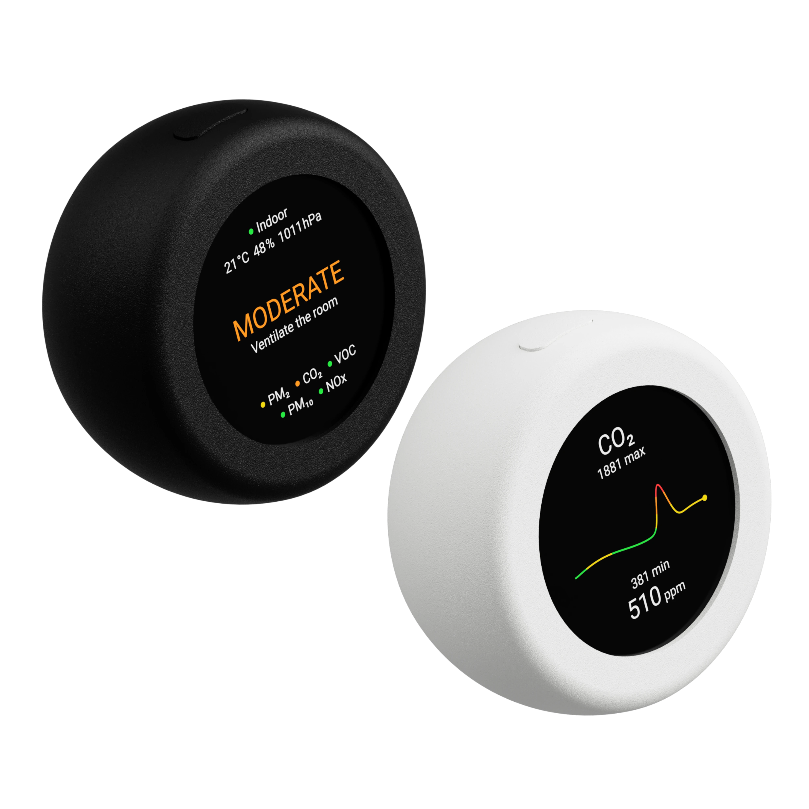

## Sensy-One AirDot

The smart indoor air-quality display that works standalone, offline, or connected to Home Assistant.

AirDot combines real-time air-quality sensing, a sharp 480 x 480 color display, local setup, standalone operation, optional Home Assistant integration, optional MQTT publishing, time, weather, Flight Radar, alerts, and on-device history pages in one compact ESPHome-powered device.

It is designed for users who want more than raw sensor values. AirDot shows the current room status, highlights the measurements that need attention, and gives clear actions such as monitoring, ventilating, limiting exposure, or acting immediately when air quality becomes critical.

## Standout Specs

**Standalone first**

AirDot works as a local air-quality display even without Wi-Fi. Sensor readings, status guidance, display pages, alerts, and history views are available directly on the device.

**Complete indoor air-quality monitoring**

AirDot uses a Sensirion SEN66 air-quality sensor to measure:

- PM1
- PM2.5
- PM4
- PM10
- CO2
- VOC Index
- NOx Index
- Temperature
- Relative humidity

**Pressure compensation**

AirDot includes a SPA06 barometric pressure sensor. The firmware uses this reading for SEN66 ambient pressure compensation and also publishes pressure as a measurement.

**480 x 480 color display**

The round display shows a live air-quality summary, local time, outdoor weather, Flight Radar, and dedicated history pages for each sensor value. It supports dark mode, manual and automatic brightness, automatic page switching, and a night mode schedule that can dim or turn off the display.

**On-device guidance and history**

AirDot classifies the current room condition into clear status levels and gives practical guidance. Each sensor value has its own history page, so you can see how readings changed over time.

**Critical value focus**

When a measurement reaches a dangerous level, AirDot can automatically switch to the history page for the sensor with the highest risk. This helps you see what changed and decide what to do next.

**Air-quality profiles**

The selected guideline can be changed in setup. Available profiles include Global WHO/EEA Strict, Europe EEA, North America US EPA 2024, UK DAQI 5, India NAQI 5, China CN AQI 5, and Australia NSW 1H.

**Time and weather**

AirDot can show local time and outdoor weather on a dedicated display page. Weather can use automatic location or the shared exact latitude/longitude location configured in setup.

**Flight Radar**

AirDot can show nearby aircraft on a minimal radar-style page when Wi-Fi and location are configured. Standard aircraft follow the selected display theme, while military or priority traffic is highlighted in orange.

**Audio and display alerts**

The built-in buzzer can play warning tones when air quality becomes critical. Home Assistant can also send custom display alerts to AirDot, with optional sound, configurable duration, text color, and supported alert icons.

**Home Assistant integration**

AirDot can expose its measurements through ESPHome's native Home Assistant API and can be automatically discovered when Home Assistant discovery is enabled in setup. Home Assistant can also control display power and brightness, and can send display alerts to the device.

**MQTT publishing**

MQTT publishing is available for users who prefer an MQTT-based setup. Broker, credentials, topic prefix, discovery, and publishing interval can be configured from the setup page.

**Local setup portal**

AirDot has its own setup flow. On first boot, the device asks you to select a language, then opens a local setup page for Wi-Fi, location, Home Assistant, MQTT, display preferences, time, weather, Flight Radar, calibration, alerts, and firmware updates.

**Sensor calibration**

Temperature offset and forced CO2 baseline calibration can be configured from setup. This helps align readings with a trusted reference or recalibrate CO2 when the device is placed in fresh outdoor air.

**Firmware updates**

Firmware updates can be installed from the local setup page using OTA update files from the release page. Factory firmware can also be reinstalled through ESPHome Web if needed.

**Powered by ESP32-S3**

AirDot runs on an ESP32-S3 platform with 16 MB flash and octal PSRAM, using the ESP-IDF framework for reliable networking, display rendering, OTA updates, and local runtime features.

## From Power On to Setup

Power AirDot with a suitable 5V power supply.

On first boot, AirDot opens its onboarding screen and asks you to choose a language on the display.

To configure AirDot:

1. Use short presses on the action button to select your language.
2. Long-press the action button to confirm the language.
3. AirDot shows the setup connection instructions.
4. Open Wi-Fi on your phone, tablet, or computer.
5. Connect to the AirDot setup network shown on the display, usually `airdot-xxxxxx`.
6. Open a browser and go to `http://192.168.4.1`.
7. Choose a 2.4 GHz Wi-Fi network, or continue without Wi-Fi.
8. Configure location, Home Assistant, MQTT, time, weather, Flight Radar, display, alerts, and calibration settings.
9. Save the settings and wait while AirDot applies them.

AirDot validates Wi-Fi after saving. If the connection fails, it returns to setup so you can correct the network or password.

> Tip: ESP32 devices use 2.4 GHz Wi-Fi. 5 GHz networks are not supported.

## Using AirDot Without Wi-Fi

AirDot can run without Wi-Fi for local display use. Indoor sensor readings and display pages continue to work.

Without Wi-Fi, these features are unavailable:

- Home Assistant integration
- MQTT publishing
- Automatic time sync
- Weather updates
- Flight Radar

You can reopen setup later and add Wi-Fi when needed.

## Home Assistant Integration

When Home Assistant discovery is enabled, AirDot is discoverable through ESPHome after it joins your Wi-Fi network.

AirDot publishes these entities to Home Assistant:

- Light, in lx
- Pressure, in hPa
- PM1, in ug/m3
- PM2.5, in ug/m3
- PM4, in ug/m3
- PM10, in ug/m3
- Temperature, in deg C
- Humidity, in %
- VOC Index
- NOx Index
- CO2, in ppm
- Action Button
- Display Brightness, as a number from 0 to 100%
- Display Power, as an on/off switch

The default publication interval is 10 seconds. In setup, this can be changed to 5, 10, or 30 seconds.

Display Brightness uses a number field. When automatic brightness is enabled, AirDot keeps the display brightness controlled by the ambient light sensor and publishes the current effective value back to Home Assistant. When automatic brightness is disabled, the Home Assistant number acts as the manual display brightness setting.

AirDot also exposes ESPHome API actions for display notifications:

- `show_display_alert`
- `clear_display_alert`

`show_display_alert` accepts:

- `title`
- `message`
- `duration_seconds`
- `sound_enabled`
- `sound_duration_ms`
- `text_color`

The exact Home Assistant action name depends on the device name generated by ESPHome. Look for the AirDot ESPHome actions in Home Assistant after the device is added.

Display alert text supports a small set of monochrome Noto Emoji icons:

✅⚠️🚨❌💡🌡🔒🚪⚡🔋💧🔥🏠⏰

## MQTT Integration

MQTT can be enabled from the setup page.

You can configure:

- Broker address
- Port
- Username
- Password
- Topic prefix
- Publishing interval

The default topic prefix is `airdot`. MQTT discovery is enabled in the firmware when MQTT is configured.

MQTT also exposes the Action Button state when MQTT discovery is enabled.

## Display Pages

Press the action button shortly to cycle through AirDot's pages.

Available pages:

- Air-quality summary
- Time and weather
- Flight Radar
- PM1 history
- PM2.5 history
- PM4 history
- PM10 history
- CO2 history
- VOC Index history
- NOx Index history
- Temperature history
- Humidity history
- Pressure history
- Light history

The time and weather page appears when time is available and either time sync or weather is enabled. The Flight Radar page appears when Wi-Fi is configured and Flight Radar is enabled.

## Action Button

The physical action button controls the local UI.

- Short press: move to the next display page.
- Double press: return to the overview screen.
- Short press during a critical air-quality alert: snooze the alert sound and critical value focus for 15 minutes.
- Long press, about 0.8 seconds: open setup or confirm the current onboarding action.
- Press during night mode or when display power is off: wake the display temporarily.
- Hold for about 10 seconds: factory reset AirDot. Keep holding through the countdown to complete the reset.

If AirDot is showing a Home Assistant display alert, pressing the button dismisses the alert.

The Action Button is also available in Home Assistant and MQTT.

## Display Settings

The setup page lets you configure:

- Language: English, German, Dutch, French, Hungarian, or Czech
- Units: metric or imperial
- Brightness: low, medium, or high
- Dark mode
- Automatic brightness based on ambient light
- Automatic page switching
- Page switching interval: 5, 10, or 30 seconds
- Time format: 24-hour or 12-hour
- Night mode schedule
- Night mode display behavior: display off or dim display

> Note: Lux measurement and automatic brightness are only available on AirDot White. On AirDot Black, the lux value will stay at 0 lx and automatic brightness is not available.

The local brightness presets map to these user-facing brightness percentages:

- Low: 25%
- Medium: 50%
- High: 75%

Home Assistant can set brightness from 0 to 100%. A value of 0 turns the backlight off. A value of 1 is the minimum manual brightness, and higher values follow the display brightness curve up to full brightness.

If night mode is enabled, AirDot needs a valid time source or manual time to know when the schedule is active. In night mode, the display can either turn off completely or use the same backlight level as Home Assistant brightness 0.

## Location

AirDot can use a shared location for features that need an outdoor position.

Location options:

- Automatic location
- Exact latitude and longitude

Exact location can be enabled from setup when Wi-Fi is configured. When enabled, the same latitude and longitude can be used by Weather and Flight Radar.

## Time and Weather

AirDot can show local time and outdoor weather on the display.

Time options:

- Automatic network time
- Manual date and time
- 24-hour or 12-hour format

Weather options:

- Disabled
- Automatic location
- Exact location

When weather is enabled, AirDot requests forecast data every 15 minutes after a valid location is available.

## Flight Radar

AirDot can show nearby aircraft on a dedicated radar page.

Flight Radar options:

- Disabled or enabled
- Radar range
- All aircraft or military-only traffic

The radar uses the configured exact location when available. If exact location is not enabled, AirDot can use automatic location when Wi-Fi and internet access are available.

The radar display is intentionally minimal: compass ticks, a north indicator, rotating aircraft markers, full callsigns, and connector lines. Standard aircraft use the display theme color, and military or priority aircraft are shown in orange.

## Air-Quality Warm-Up

After boot, AirDot allows the air-quality sensor to warm up before publishing validated air-quality measurements. The default warm-up period is 120 seconds.

During warm-up, the display may show placeholders for some status values and Home Assistant may not receive all air-quality entities yet. This is normal.

## Best Placement Practices

For the best air-quality readings, place AirDot where room air can naturally reach the sensor.

Recommended placement:

- In the room where you want to monitor air quality.
- On an open shelf, desk, or wall mount with free airflow.
- Away from direct sunlight.
- Away from heaters, radiators, lamps, and other heat sources.
- Away from direct airflow from HVAC vents, fans, or open windows.
- Humid rooms such as bathrooms are fine; place AirDot where it is not directly exposed to splashes or standing water.

Avoid placing AirDot inside cabinets, behind curtains, close to cooking steam, or directly next to a purifier outlet. Those spots can create readings that do not represent the room.

## Sensor Calibration

### Temperature Offset

AirDot lets you compensate the built-in SEN66 temperature reading from the setup page.

Use this if the internal temperature reads consistently too high compared with a trusted reference thermometer.

To adjust:

1. Let AirDot run in its normal location for several minutes.
2. Compare the AirDot temperature with a trusted thermometer nearby.
3. Open setup.
4. Adjust the SEN66 temperature offset.
5. Save settings.

### CO2 Baseline Calibration

AirDot supports forced CO2 baseline calibration from the setup page.

To calibrate:

1. Place AirDot in fresh outdoor air for at least 3 minutes.
2. Open setup.
3. Enable forced CO2 baseline calibration.
4. Keep the default reference value unless you have a reliable reason to change it.
5. Save settings.

Only perform CO2 calibration when the air is stable and genuinely fresh. Calibrating in occupied indoor air can make future CO2 readings inaccurate.

## Alerts

AirDot can warn you when measurements become critical.

Available alert settings:

- Sound alerts: play a warning tone when a measurement reaches a dangerous level.
- Critical value focus: automatically switch to the chart for the highest-risk sensor.
- Wake screen for Home Assistant alerts: turn on the display when Home Assistant sends a display alert.

When a critical air-quality tone or focus page is active, a short button press snoozes the alert sound and critical focus for 15 minutes and returns control to the normal page flow.

## Firmware Updates

AirDot supports firmware updates through the setup page.

The firmware update section shows the currently installed firmware version.

### Update From AirDot Setup

1. Download the latest OTA firmware from the [releases page](https://github.com/sensy-one/AirDot/releases).
2. Open setup by long-pressing the action button.
3. Connect to the AirDot setup network if required.
4. Open `http://192.168.4.1`.
5. Go to Firmware update.
6. Select the OTA `.bin` firmware file.
7. Click Update firmware.
8. Wait for AirDot to finish and reboot.

Do not remove power during a firmware update.

## Factory Firmware

If AirDot is not behaving as expected, reinstalling factory firmware can help.

To reinstall factory firmware:

1. Download the latest AirDot factory firmware from the [releases page](https://github.com/sensy-one/AirDot/releases).
2. Connect AirDot to your computer using a USB data cable.
3. Open the ESPHome web flasher at `https://web.esphome.io/`.
4. Click Connect and select the correct serial port.
5. Choose Install.
6. Select the factory firmware file.
7. Wait for flashing to complete, then reboot AirDot.

If the device does not appear as a serial port, try another USB cable. Some USB cables provide power only and do not carry data.

## Factory Reset

Factory reset clears saved settings and returns AirDot to first-run setup.

To factory reset:

1. Press and hold the action button.
2. Keep holding after the setup long-press appears.
3. Continue holding through the factory reset countdown.
4. Release only after the reset starts.

After reset, AirDot starts the setup access point again.

## Troubleshooting

**AirDot does not appear in Home Assistant**

- Make sure Home Assistant discovery is enabled in AirDot setup.
- Confirm AirDot is connected to the same network as Home Assistant.
- Check that the network allows mDNS/ESPHome discovery.
- Add the device manually in Home Assistant if discovery is blocked.

**Wi-Fi setup fails**

- Use a 2.4 GHz Wi-Fi network.
- Re-enter the Wi-Fi password.
- Move AirDot closer to the router during setup.
- Avoid networks that require captive portals or web login pages.

**The display is off**

- Press the action button once to wake it.
- Check whether night mode is active.
- Check the Display Power switch in Home Assistant.
- Check brightness and automatic brightness settings.
- Confirm the device is powered.

**Weather is missing**

- Make sure Wi-Fi is configured.
- Make sure weather is enabled in setup.
- For automatic location, confirm the network has internet access.
- For exact location, check that latitude and longitude are filled in correctly.

**Flight Radar is missing**

- Make sure Wi-Fi is configured.
- Make sure Flight Radar is enabled in setup.
- Check that a location is available through exact location or automatic location.
- Confirm the selected radar range and traffic mode.

**Measurements are missing in Home Assistant**

- Wait until the 120-second sensor warm-up is complete.
- Check that Home Assistant discovery is enabled.
- Check the publication interval in setup.
- Reboot AirDot if Home Assistant still does not update.

**Temperature reads too high**

- Let AirDot stabilize in its normal location.
- Compare it with a trusted thermometer placed nearby.
- Open setup and adjust the SEN66 temperature offset under Sensor calibration.
- Enter the difference by which AirDot reads too high, then save.

**CO2 readings look wrong after calibration**

- Repeat calibration only in fresh outdoor air.
- Let AirDot stabilize before calibrating.
- Avoid calibrating in an occupied room or near traffic, cooking, or ventilation exhaust.

## Privacy and External Connections

AirDot works locally for indoor sensing and display use.

Depending on your settings, AirDot may connect to:

- Home Assistant over your local network.
- Your MQTT broker over your local network.
- Online time, weather, and aircraft data services when those features are enabled.

## Let's Connect

Discord:

- Join the community and get support on our [Discord server](https://discord.gg/TB78Wprn66).

GitHub Issues:

- Found a bug or have a suggestion? Report it on the [GitHub issues page](https://github.com/sensy-one/AirDot/issues).
